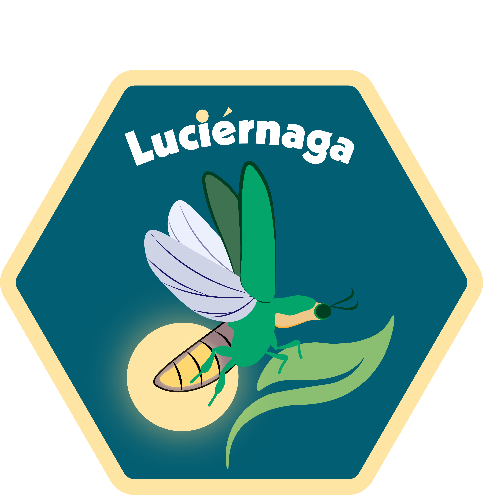

Coereba
================
David Rach
<h4>  
README updated: <i>Jan-28-2024</i>  
</h4>

<!-- To modify Package/Title/Description/Authors fields, edit the DESCRIPTION file -->
<!-- badges: start -->

[](https://github.com/DavidRach/Coereba/actions)
[-blue.svg)](https://cran.r-project.org/web/licenses/AGPL%20(%3E=%203))
[](https://github.com/DavidRach/Coereba)
[](https://github.com/DavidRach/Coereba)
[](https://github.com/DavidRach/Coereba/commits/master)
<br> <!-- badges: end -->



## `Coereba`: Dichotomized Boolean Clustering and Heatmaps for Spectral Flow Cytometry

### Acknowledging the limitations of unsupervized analysis and

downsampling, through a semi-supervised gating implements dichotomized
boolean gates to cluster every cell from an experiment and querry the
resulting subclusters.

If you use `Coereba`, please cite:

<!-- Modify this by editing the file: inst/CITATION  -->

## Installation

``` r
if(!require("remotes")) install.packages("remotes")

remotes::install_github("https://github.com/DavidRach/Coereba")
library(Coereba)
```

## Documentation

### [Website](https://davidrach.github.io/Coereba)

### [Get started](https://davidrach.github.io/Coereba/articles/Coereba)

<br>
