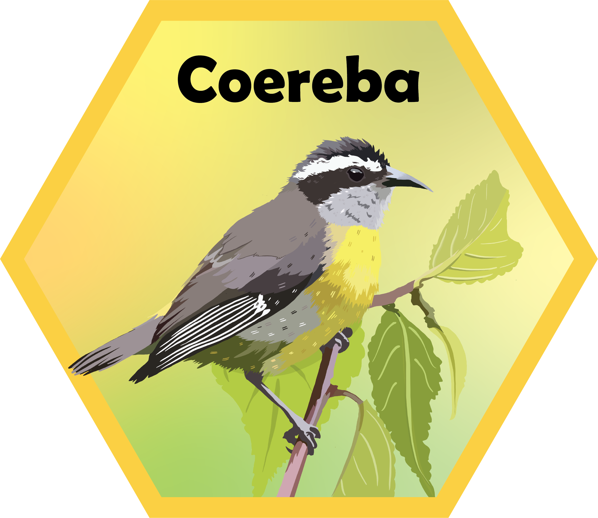

# Welcome to `Coereba` 

<!-- To modify Package/Title/Description/Authors fields, edit the DESCRIPTION file -->
<!-- badges: start -->

[](https://github.com/DavidRach/Coereba/actions)
[-blue.svg)](https://cran.r-project.org/web/licenses/AGPL%20(%3E=%203))
[](https://github.com/DavidRach/Coereba)
[](https://github.com/DavidRach/Coereba)
[](https://github.com/DavidRach/Coereba/commits/master)
[](https://codecov.io/gh/DavidRach/Coereba)
<br> <!-- badges: end -->

## `Coereba`: Dichotomized Clustering for Spectral Flow Cytometry

Coereba is a collection of tools allowing researchers to extend their understanding of their panels and datasets. 


### Installation

We are in the process of getting Coereba ready to submit to Bioconductor. Until then, please download the package from github. 

``` r
if(!require("remotes")) install.packages("remotes")

remotes::install_github("https://github.com/DavidRach/Coereba")

library(Coereba)

# install.packages("BiocManager")
# BiocManager::install("Coereba")
```

### Get Started

Please check out our how-to [vignettes](https://davidrach.github.io/Coereba/articles/GettingStarted.html)
to get started


### Found a bug? Report it!

While we have caught a lot of bugs, there's still unknown ones that we haven't encountered. If you find a suspected bug, please report it here [here](https://github.com/DavidRach/Coereba/issues)


